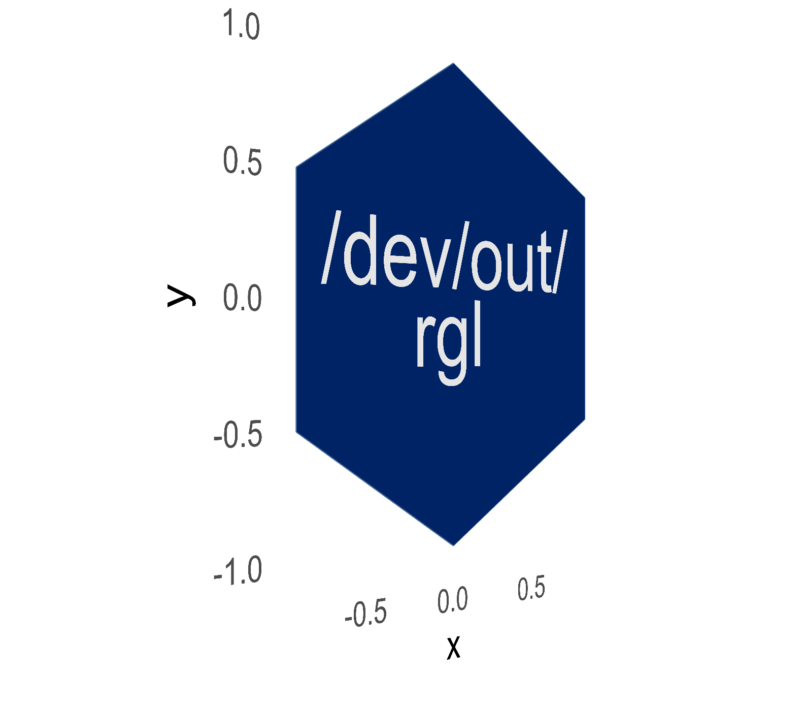
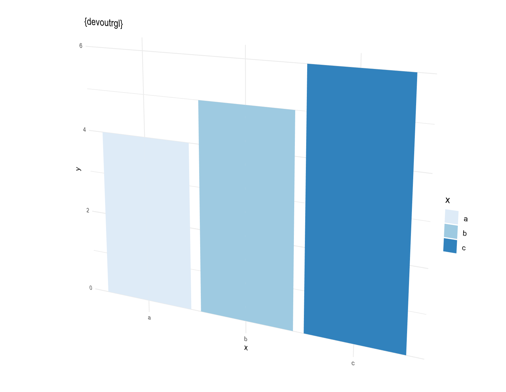
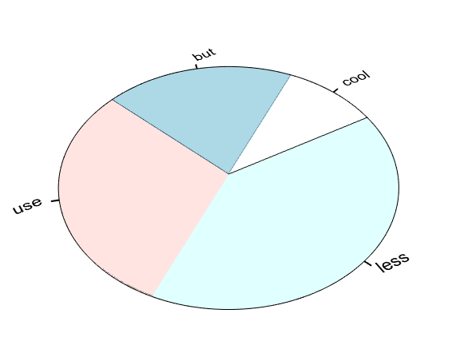
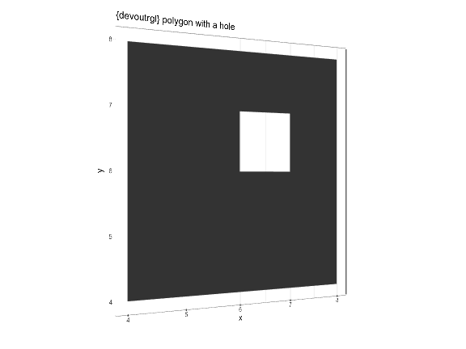
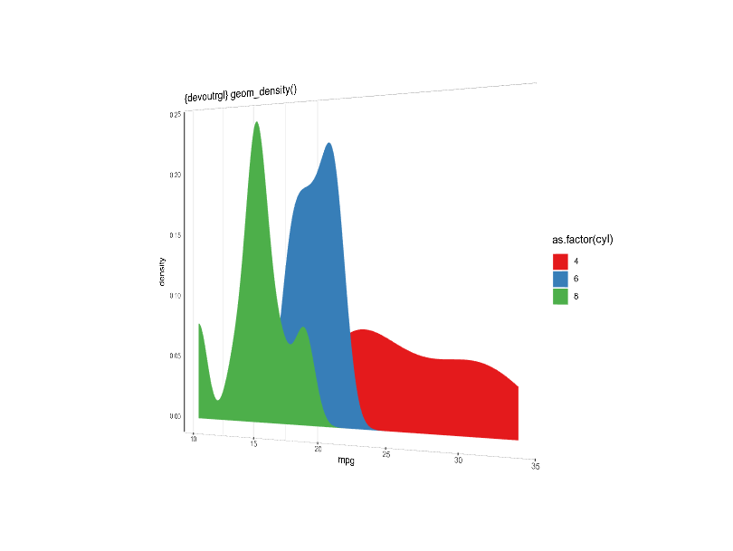

<!-- README.md is generated from README.Rmd. Please edit that file -->

# devoutrgl 

<!-- badges: start -->


 [](https://www.tidyverse.org/lifecycle/#experimental)
<!-- badges: end -->

`devoutrgl::rgldev()` is a graphics device - like `pdf()` or `png()`.
This device will render a plot as an interactive 3d opengl document
using `{rgl}`.

**NOTE: Since Github does not allow webgl rendering in README files, all
plots on GitHub have been rendered as PNGs or animated gifs. Please
visit [the package
website](https://coolbutuseless.github.io/package/devoutrgl) to interact
with the generated output in the vignettes**

## What’s in the box:

  - `rgldev()` is the rgl device. Use it like you would use the `pdf()`
    device or the `png()` device.

## Installation

You can install from
[GitHub](https://github.com/coolbutuseless/devoutrgl) with:

``` r
# install.packages("remotes")
remotes::install_github("coolbutuseless/snowcrash")  # Store R objects as images
remotes::install_github("coolbutuseless/cryogenic")  # Freeze R calls + replay
remotes::install_github("coolbutuseless/triangular") # Polygon Triangulation
remotes::install_github("coolbutuseless/devout")     # R device framework
remotes::install_github("coolbutuseless/devoutrgl")  # This device
```

## Limitations

  - No font selection. Everything will be in the default sans serif\!
  - Multi-line text in a single string with “” characters does not
    render well.
  - No support for clipping paths.

# Examples

## Bar Plot

``` r
library(ggplot2)
library(devoutrgl)

plot_df <- data.frame(x=c('a', 'b', 'c'), y=4:6)
p <- ggplot(plot_df) +
  geom_bar(aes(x, y, fill=x), colour = NA, stat='identity') +
  labs(title = "{devoutrgl}") +
  scale_fill_brewer(type = 'seq', palette = 'Blues') + 
  theme_minimal() + theme_rgl()


devoutrgl::rgldev(fov = 30, view_angle = -30)
p
invisible(dev.off())
```

View an interactive version of this plot in the
<a href="https://coolbutuseless.github.io/package/devoutrgl/articles/simple-examples.html">online
documentation</a>



## Base plot

``` r
devoutrgl::rgldev(fov = 30, view = 'flat', view_angle = 30, zoom = 0.6, filename = "man/figures/pie.png") 
pie(c(cool=1, but = 2, use=3, less = 4))
dev.off()
```

View an interactive version of this plot in the
<a href="https://coolbutuseless.github.io/package/devoutrgl/articles/simple-examples.html">online
documentation</a>



## Polygon with a hole

# Polygon with a hole

``` r
#~~~~~~~~~~~~~~~~~~~~~~~~~~~~~~~~~~~~~~~~~~~~~~~~~~~~~~~~~~~~~~~~~~~~~~~~~~~~~
# polygons_df - data.frame of polygon vertices with group/subgroups
#~~~~~~~~~~~~~~~~~~~~~~~~~~~~~~~~~~~~~~~~~~~~~~~~~~~~~~~~~~~~~~~~~~~~~~~~~~~~~
polygons_df <- df <- data.frame(
  x        = c(4, 8, 8, 4,   6, 7, 7, 6),
  y        = c(4, 4, 8, 8,   6, 6, 7, 7),
  group    = c(1, 1, 1, 1,   1, 1, 1, 1),
  subgroup = c(1, 1, 1, 1,   2, 2, 2, 2)
)

#~~~~~~~~~~~~~~~~~~~~~~~~~~~~~~~~~~~~~~~~~~~~~~~~~~~~~~~~~~~~~~~~~~~~~~~~~~~~~
# Plot
#~~~~~~~~~~~~~~~~~~~~~~~~~~~~~~~~~~~~~~~~~~~~~~~~~~~~~~~~~~~~~~~~~~~~~~~~~~~~~
p <- ggplot(polygons_df) +
  geom_polygon(aes(x, y, group=group, subgroup=subgroup)) +
  geom_path(aes(x, y, group = interaction(group, subgroup)), colour = 'red') +
  theme_bw() + 
  coord_equal() + 
  labs(title = "{devoutrgl} polygon with a hole")

rgldev(fov = 30, view_angle = -30, zoom = 0.8)
p
invisible(dev.off())
```

View an interactive version of this plot in the
<a href="https://coolbutuseless.github.io/package/devoutrgl/articles/simple-examples.html">online
documentation</a>



## Density Plot

``` r
library(ggplot2)
library(devoutrgl)

p <- ggplot(mtcars) +
  geom_density(aes(mpg, fill=as.factor(cyl)), colour = '#ffffff00') +
  theme(legend.position = 'none') +
  scale_fill_brewer(palette = 'Set1') + 
  theme_bw() +
  labs(title = "{devoutrgl} geom_density()")


rgldev(fov = 30, view_angle = 30)
p
invisible(dev.off())
```

View an interactive version of this plot in the
<a href="https://coolbutuseless.github.io/package/devoutrgl/articles/simple-examples.html">online
documentation</a>



## Generating the logo for this package

``` r
library(ggplot2)
library(dplyr)

hex_df <- tibble(
  rad = seq(0, 2*pi, pi/3),
  x   = sin(rad),
  y   = cos(rad)
)

p <- ggplot(hex_df) +
  geom_polygon(aes(x, y), fill = '#002366', colour = '#436B9530') +
  annotate('text', x = 0, y = 0, label = "/dev/out/\n\n\nrgl", size = 20, color = 'grey90') +
  coord_fixed() +
  theme_minimal(25) + 
  theme(panel.grid = element_blank())

devoutrgl::rgldev(
  width       = 5.5,
  fov         = 30,
  view3d_args = list(-45, 0, zoom = 0.8),
  dpi         = 300,
  filename    = "man/figures/logo-new.png"
)

p
invisible(dev.off())
```

View an interactive version of this plot in the
<a href="https://coolbutuseless.github.io/package/devoutrgl/articles/simple-examples.html">online
documentation</a>


